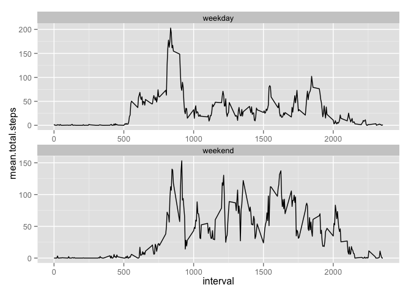

# Reproducible Research: Peer Assessment 1
[Christopher Curley](https://github.com/ccurley)  
9 Jan 2016  

## Loading and preprocessing the data
1. load the data
2. Process/tranform the data (if necessary) into a format suitable for analysis.

I forked the repository for the [class](https://github.com/rdpeng/RepData_PeerAssessment1) on Saturday, 8 January 2016.

Note that I set the working directory is set to the RepData_PeerAssessment1 repository in GitHub.


```r
# Check to see if the zipfile file exists, if it does unzip it
# Note that the working direcory is set to the RepData_PeerAssessment1 repository in GitHub
if(file.exists("activity.zip")) {
        unzip("activity.zip")
} else {
        print("activity.zip not found. Check default working directory")
}
```


```r
# Check to see if the csv file exists, if it does read it into a df named fitdata

if(file.exists("activity.csv")) {
        fitdata <- read.csv("activity.csv")
} else {
        print("activity.cvs not found. Check default working directory or unzip activity.zip")
}
```

The result should be a dataframe with 17,568 observations of 3 variables with the following characteristics:


```r
summary(fitdata)
```

```
##      steps                date          interval     
##  Min.   :  0.00   2012-10-01:  288   Min.   :   0.0  
##  1st Qu.:  0.00   2012-10-02:  288   1st Qu.: 588.8  
##  Median :  0.00   2012-10-03:  288   Median :1177.5  
##  Mean   : 37.38   2012-10-04:  288   Mean   :1177.5  
##  3rd Qu.: 12.00   2012-10-05:  288   3rd Qu.:1766.2  
##  Max.   :806.00   2012-10-06:  288   Max.   :2355.0  
##  NA's   :2304     (Other)   :15840
```


```r
names(fitdata)
```

```
## [1] "steps"    "date"     "interval"
```


```r
str(fitdata)
```

```
## 'data.frame':	17568 obs. of  3 variables:
##  $ steps   : int  NA NA NA NA NA NA NA NA NA NA ...
##  $ date    : Factor w/ 61 levels "2012-10-01","2012-10-02",..: 1 1 1 1 1 1 1 1 1 1 ...
##  $ interval: int  0 5 10 15 20 25 30 35 40 45 ...
```


```r
head(fitdata)
```

```
##   steps       date interval
## 1    NA 2012-10-01        0
## 2    NA 2012-10-01        5
## 3    NA 2012-10-01       10
## 4    NA 2012-10-01       15
## 5    NA 2012-10-01       20
## 6    NA 2012-10-01       25
```

Lots of NAs in steps?


```r
sum(is.na(fitdata$steps)) / nrow(fitdata)
```

```
## [1] 0.1311475
```

## What is mean total number of steps taken per day?
For this part of the assignment, you can ignore the missing values in the dataset.

1. Make a histogram of the total number of steps taken each day


```r
# To calculate the mean total steps taken per day, I applied two methods. The first calls my preferred method 
# *ddply* to produce a data frame. You can do this with  with(fitdata, tapply(steps, date, FUN = mean, na.rm = FALSE))
# also.
library(plyr)
```

```
## Warning: package 'plyr' was built under R version 3.1.3
```

```r
library(dplyr)
```

```
## Warning: package 'dplyr' was built under R version 3.1.3
```

```
## 
## Attaching package: 'dplyr'
## 
## The following objects are masked from 'package:plyr':
## 
##     arrange, count, desc, failwith, id, mutate, rename, summarise,
##     summarize
## 
## The following objects are masked from 'package:stats':
## 
##     filter, lag
## 
## The following objects are masked from 'package:base':
## 
##     intersect, setdiff, setequal, union
```

```r
totalsteps <- ddply(fitdata, .(date), summarize, mean.total.steps = mean(steps))

hist(totalsteps$mean.total.steps, xlab = "total steps daily - ddply")
```

 

2. Calculate and report the mean and the median total number of steps taken per day.


```r
mean(totalsteps$mean.total.steps, na.rm = TRUE)
```

```
## [1] 37.3826
```

```r
median(totalsteps$mean.total.steps, na.rm = TRUE)
```

```
## [1] 37.37847
```

## What is the average daily activity pattern?
1. Make a time series plot (i.e. type = "l") of the 5-minute interval (x-axis) and the average number of steps taken, averaged across all days (y-axis)


```r
# calcuate the interval steps by summarizing the mean of steps grouped by interval
library(plyr)
library(dplyr)
intervalsteps <- ddply(fitdata, .(interval), summarize, mean.interval.steps = mean(steps, na.rm = TRUE))

with(intervalsteps, plot(interval, mean.interval.steps, type = "l"))
```

 

2. Which 5-minute interval, on average across all the days in the dataset, contains the maximum number of steps?


```r
# find the max number from the mean.interval.steps by subsetting using which.max
intervalsteps[which.max(intervalsteps$mean.interval.steps),]
```

```
##     interval mean.interval.steps
## 104      835            206.1698
```

## Inputing missing values
1. Calculate and report the total number of missing values in the dataset (i.e. the total number of rows with NAs)


```r
sum(is.na(fitdata$steps))
```

```
## [1] 2304
```

```r
sum(is.na(fitdata$date))
```

```
## [1] 0
```

```r
sum(is.na(fitdata$interval))
```

```
## [1] 0
```

2. Devise a strategy for filling in all of the missing values in the dataset. The strategy does not need to be sophisticated. For example, you could use the mean/median for that day, or the mean for that 5-minute interval, etc.

3. Create a new dataset that is equal to the original dataset but with the missing data filled in.


```r
# Push fitdata to a new data frame I can corrupt at will
fitdataskewed <- fitdata

# The excercise says devise a strategy, and here's mine: 
# rather than looping through the table and jamming in the mean val,
# I'm going to assume that NA is 0 since having no data can be seen as having a value of none.
# Like Snape wrote in his potions textbook, "Just stick a bezoar down his throat!"
fitdataskewed[is.na(fitdataskewed),1] <- 0
nrow(fitdata)
```

```
## [1] 17568
```

```r
nrow(fitdataskewed)
```

```
## [1] 17568
```

4. Make a histogram of the total number of steps taken each day and Calculate and report the mean and median total number of steps taken per day. Do these values differ from the estimates from the first part of the assignment? What is the impact of imputing missing data on the estimates of the total daily number of steps?


```r
library(plyr)
library(dplyr)
skewedsteps <- ddply(fitdataskewed, .(date), summarize, mean.total.steps = mean(steps))
hist(skewedsteps$mean.total.steps, xlab = "total skewed steps daily - ddply")
```

 

```r
mean(skewedsteps$mean.total.steps, na.rm = TRUE)
```

```
## [1] 32.47996
```

```r
median(skewedsteps$mean.total.steps, na.rm = TRUE)
```

```
## [1] 36.09375
```

The skewed values, not surprisingly, increase the "0" count in the histogram and lower the mean and median, since we're introducing more zero values to the dataset. The means falls about 5% and and the meadian fall about 1%.


## Are there differences in activity patterns between weekdays and weekends?
For this, I've pulled heavily on Stackoverflow for the simplest and fastest answer.  

"[Stackoverflow](http://stackoverflow.com/questions/33104456/divide-time-series-data-into-weekday-and-weekend-datasets-using-r)"

To answer the question whether there are differences in patterns, I just need to tack a "week end" or "week day" designation to the fitdata df.  

1. Create a new factor variable in the dataset with two levels -- "weekday" and "weekend" indicating whether a given date is a weekday or weekend day.


```r
# Thank you stackoverflow....
weekday <- function(date) {
    if (weekdays(as.Date(date)) %in% c("Saturday", "Sunday")) {
        "weekend"
    } else {
        "weekday"
    }
}

# New factor, and it's applied to the skewed data frame.
fitdataskewed$weekday <- as.factor(sapply(fitdata$date, weekday))

# Create a data set that calcuates the mean steps grouped by weekday, then grouped by interval
weeksteps <- ddply(fitdataskewed, .(weekday, interval), summarize, mean.total.steps = mean(steps))
```


2. Make a panel plot containing a time series plot (i.e. type = "l") of the 5-minute interval (x-axis) and the average number of steps taken, averaged across all weekday days or weekend days (y-axis).


```r
# Create two line diagrams, facet the plot by weekend. Note, there was a discussion on stackoverflow 
# about how to do this with 'plot' without using facets by putting the plot statement in a for loop 
# forked by 'weekend' or 'weekday'. Crazy thing worked. Go back to the first commit for code in action.
library(ggplot2)
```

```
## Warning: package 'ggplot2' was built under R version 3.1.3
```

```r
ggplot(weeksteps, aes(x=interval, y=mean.total.steps)) + geom_line() + facet_wrap( ~ weekday, scales = "free", nrow = 2)
```

 

There appears to be greater activity across the mid-day intervals relative to the weekday, which is not unexpected.
